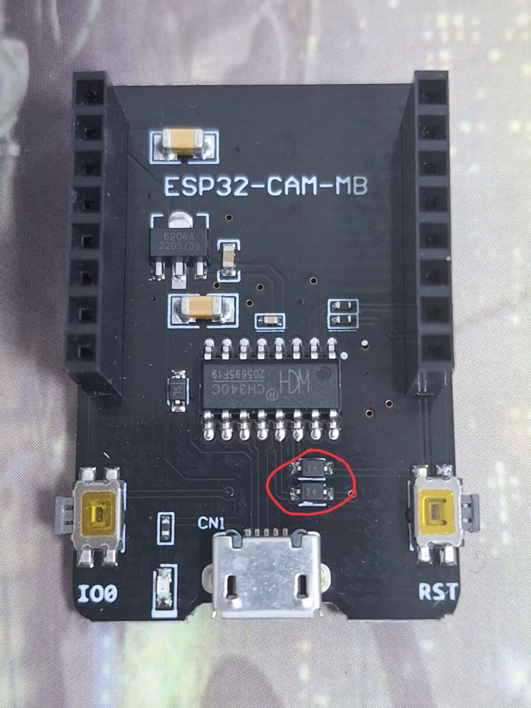
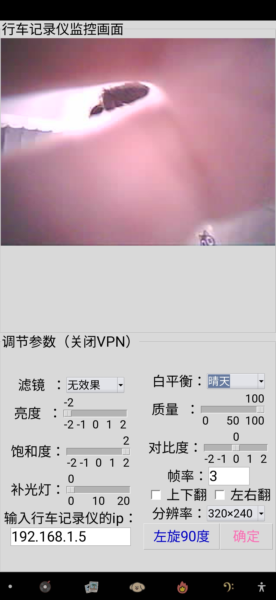
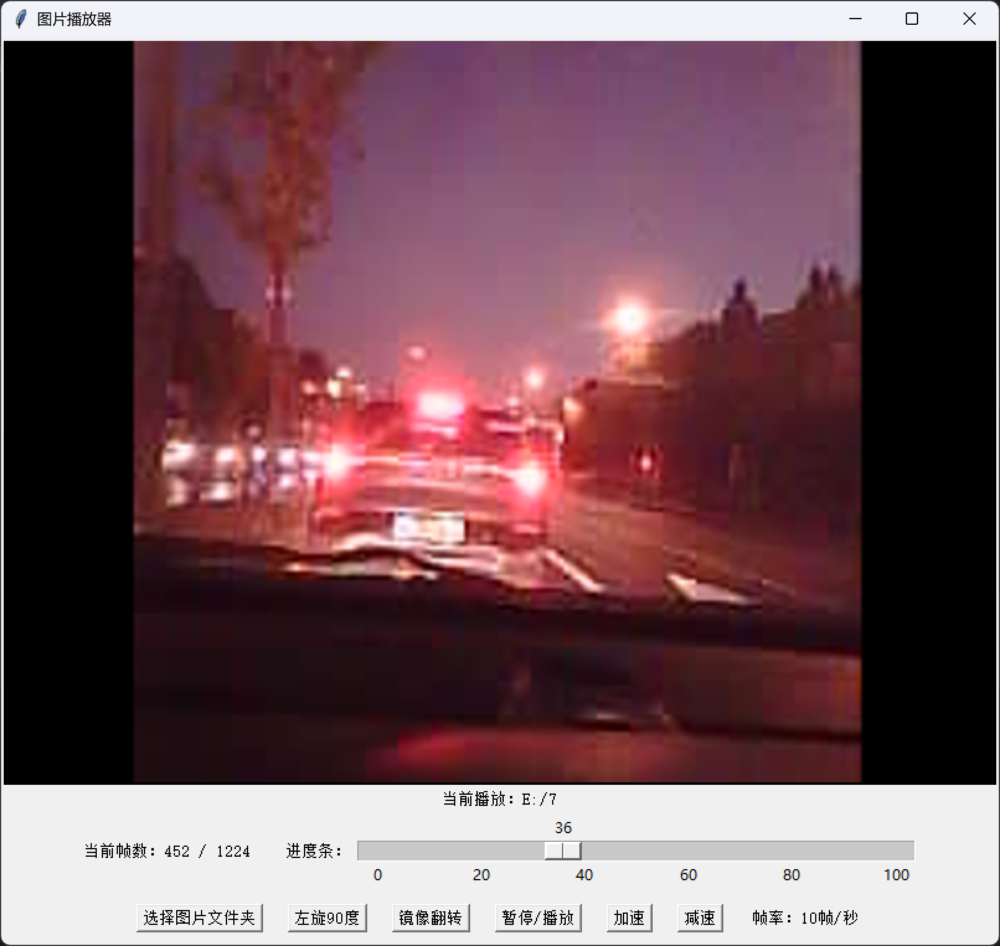

这是一个用ESP32-CAM模块实现 WIFI远程监控加遥控 以及 SD卡本地保存录像 的程序和开发指南。该程序可用作开发行车记录仪或家庭监控。

首先通过Thonny烧录这个micropython解释器进入ESP32中：micropython_camera_feeeb5ea3_esp32_idf4_4.bin

第二步，用螺丝刀撬掉下面图片中的两个元件，不然该ESP32无法与Thonny通信。具体情况请咨询卖家

第三步，修改main.py中86和88行的WIFI名和密码，并把main.py保存至ESP32中。保存完毕后，按下ESP32旁的“RST”键，即可自动运行main.py程序；也可以通过Thonny来运行

第四步，在电脑或手机上运行DashCam.py。并将ESP32的ip地址输入至下图中对应位置即可进行通讯。

如果你在ESP32-CAM的卡槽内插入了SD卡，那么程序会自动将捕获的视频保存在里面，你可以用VideoShower.py来播放这些视频。效果如下：

